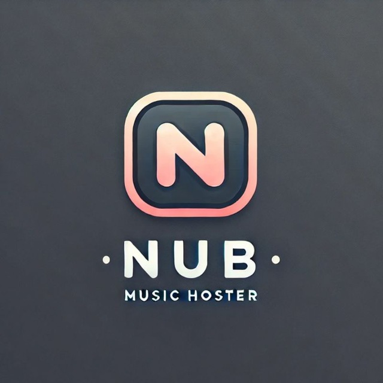

# Music Bot Project



This is a music bot project that handles various music operations.

## Features
- Play music
- Queue management
- Playlist support

## Installation

1. Clone this repository:
```bash
git clone https://github.com/nub-coders/nub-music-bot.git
cd nub-music-bot
```

2. Install dependencies:
```bash
pip install -r requirements.txt
```

3. Configure the bot (choose one method):

## Configuration Methods

**Option 1: Edit config.py**
Open `config.py` and set these values:

Required:
- `BOT_TOKEN`: Telegram bot token from @BotFather
- `API_ID`: Telegram API ID from my.telegram.org
- `API_HASH`: Telegram API hash from my.telegram.org
- `STRING_SESSION`: Pyrogram session string
- `MONGODB_URI`: MongoDB connection URI
- `OWNER_ID`: Bot owner's Telegram ID (default: 6076474757)

Optional:
- `GROUP`: Telegram group username (default: "nub_coder_s")
- `CHANNEL`: Telegram channel username (default: "nub_coders_updates")
- `LOGGER_ID`: Logging group chat ID

**Option 2: Environment Variables (for deployment)**
When deploying, set these required variables:
- `API_ID`
- `API_HASH` 
- `BOT_TOKEN`
- `STRING_SESSION`
- `MONGODB_URI`
- `OWNER_ID`

Optional variables:
- `GROUP`
- `CHANNEL`
- `LOGGER_ID`

4. Run the bot:
```bash
python main.py
```
